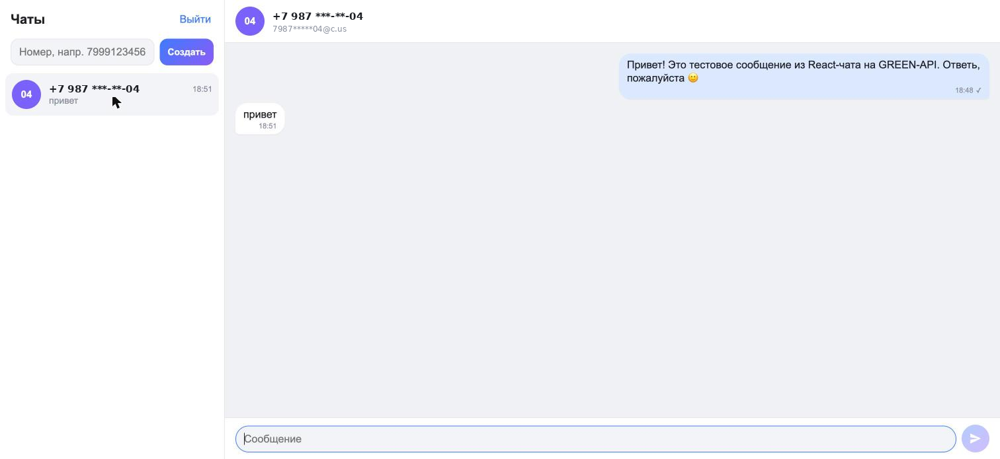

# MAX Chat на GREEN-API

Тестовое задание на должность «Фронтенд разработчик React».

Это веб-чат для отправки и получения текстовых сообщений через [GREEN-API](https://green-api.com/max). Внешний вид повторяет [web.max.ru](https://web.max.ru/).

Приложение работает с инстансами GREEN-API для **MAX**, **Telegram** и **WhatsApp**, потому что у них одинаковый HTTP API. Живая проверка выполнена на инстансе Telegram: в личном кабинете не было тарифа для MAX, а ТЗ разрешает использовать Telegram.

**Демо:** https://kerimnuriev.github.io/max-chat-green-api/



*Скриншот живой проверки на инстансе Telegram. Номер получателя скрыт.*

## Возможности

- Вход по учётным данным инстанса GREEN-API: `apiUrl`, `idInstance`, `apiTokenInstance`. При входе приложение проверяет авторизацию инстанса через `getStateInstance`.
- Создание чата по номеру телефона получателя.
- Отправка текстовых сообщений методом [SendMessage](https://green-api.com/v3/docs/api/sending/SendMessage/).
- Получение входящих сообщений по [HTTP API](https://green-api.com/v3/docs/api/receiving/technology-http-api/). Цикл long-polling вызывает `receiveNotification` и затем `deleteNotification`.
- Если входящее сообщение приходит от нового собеседника, чат создаётся автоматически. Для таких чатов показывается счётчик непрочитанных.
- Сообщения, отправленные с телефона, тоже отображаются (`outgoingMessageReceived`).
- Если чат создан по номеру телефона, а уведомления приходят с числовым ID собеседника (Telegram, MAX), приложение связывает их, и ответы попадают в тот же чат.
- История чатов хранится в `localStorage` отдельно для каждого инстанса.
- Есть адаптивная вёрстка под мобильные экраны и тёмная тема.

## Стек

React 19, TypeScript, Vite. Внешних зависимостей нет, запросы отправляются через обычный `fetch`.

```
src/
  api/greenApi.ts        — обёртки над методами GREEN-API
  hooks/useChats.ts      — состояние чатов, отправка, цикл получения уведомлений
  components/Login.tsx   — экран ввода учётных данных
  components/Sidebar.tsx — список чатов и создание нового чата
  components/ChatWindow.tsx — окно переписки и поле ввода
```

## Локальный запуск

Нужен Node.js 18 или новее.

```bash
git clone <ссылка на репозиторий>
cd max-chat
npm install
npm run dev
```

Затем откройте http://localhost:5173.

Сборка для продакшена:

```bash
npm run build     # результат в dist/
npm run preview   # просмотр собранной версии
```

## Как проверить

1. Зарегистрируйтесь в [console.green-api.com](https://console.green-api.com), создайте инстанс для MAX или Telegram и авторизуйте его через свой аккаунт.
2. В настройках инстанса включите получение уведомлений о входящих сообщениях.
3. Откройте приложение и введите `apiUrl` и `idInstance`, которые показаны в личном кабинете, а также `apiTokenInstance`.
4. Введите номер получателя в формате `79991234567` и нажмите «Создать». Вместо номера можно ввести готовый `chatId`.
5. Отправьте сообщение. Когда получатель ответит в мессенджере, ответ появится в чате в течение нескольких секунд.

## Деплой

В репозитории есть workflow для GitHub Pages (`.github/workflows/deploy.yml`). Чтобы он заработал, включите в настройках репозитория **Settings → Pages → Source: GitHub Actions**. После этого каждый push в `main` будет публиковать сайт.
